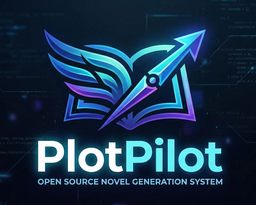
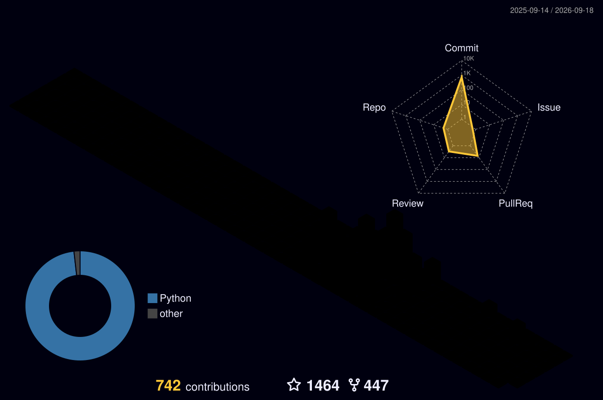

<!-- ===================== HEADER ===================== -->

**Agent & LLM infra engineer** · **[PlotPilot](https://github.com/shenminglinyi/PlotPilot) creator** · **CCPC gold medalist** · Beijing, China

> I work on the layer under the agent — the model, the memory, the retrieval, the pipelines that keep long-horizon creation coherent.

<!-- ===================== ABOUT ===================== -->
## 🚀 About

I build agent infrastructure for long-horizon AI systems: runtime orchestration, persistent memory, retrieval, evaluation loops, and backend architecture that make agents reliable beyond a single prompt.

- Building from the model layer to production runtime: planning, tool execution, memory writeback, RAG quality loops, and product workflows.
- Creator of **[PlotPilot](https://github.com/shenminglinyi/PlotPilot)**, an open-source narrative engine core for persistent world state, graph-based knowledge, autonomous story pipelines, and quality governance.
- Competitive programming background with **CCPC Gold** and **ICPC Silver**, with a strong bias toward clean abstractions, algorithmic clarity, and performance-aware engineering.
- Backend and infra fluency across **Java / Spring Boot**, **FastAPI**, **MySQL / Redis / Kafka / Elasticsearch**, **Docker / Kubernetes**, and Linux systems.

<!-- ===================== FEATURED ===================== -->
## 📦 Featured Work

<table>
  <tr>
    <td width="290" valign="top">
      
    </td>
    <td valign="top">
      <h3><a href="https://github.com/shenminglinyi/PlotPilot">PlotPilot</a></h3>
      
<strong>Open-source narrative engine core for long-form AI creation.</strong>

      
Designed around persistent memory, knowledge graphs, autonomous generation pipelines, and quality feedback loops, so creative agents can keep story worlds coherent across long runs.

      
<a href="https://github.com/shenminglinyi/PlotPilot">View repository</a>

    </td>
  </tr>
</table>

<!-- ===================== WHAT I WORK ON ===================== -->
## 🧠 Focus Areas

- **Agent runtime** — multi-agent & subagent orchestration · tool calling & MCP routing/validation · planning & reflection (ReAct / Plan-Execute) · long-horizon task runtime · checkpoint/resume
- **Agent memory** — multi-tier memory (short-term / mid-term / long-term) · Mem0 · context compression · conflict-resolution writeback
- **Retrieval / RAG** — hybrid retrieval + reranker · Graph-RAG / HippoRAG · ANN indexes (HNSW / IVF · Milvus / Faiss) · RAGAS eval · knowledge-base construction
- **Model / training** — SFT · LoRA / QLoRA · RLHF / DPO
- **Backend / infra** — Java · Spring Boot · FastAPI · Netty · MySQL / Redis · Kafka · Elasticsearch · Docker / K8s
- **Application / cognition** — agent productization · cognitive architecture & decision modeling · commercialization

<!-- ===================== TECH STACK ===================== -->
## 🧰 Tech Stack

 

<!-- ===================== GITHUB STATS ===================== -->
## 📊 Contributions

<!-- 🐍 Snake animation: generated by .github/workflows/snake.yml into assets/contrib/. -->
<picture>
  <source media="(prefers-color-scheme: dark)" srcset="./assets/contrib/github-contribution-grid-snake-dark.svg" />
  <source media="(prefers-color-scheme: light)" srcset="./assets/contrib/github-contribution-grid-snake.svg" />
  
</picture>

 

<!-- 🧊 3D contribution graph: generated by .github/workflows/3d-contrib.yml into profile-3d-contrib/. -->

<!-- ===================== HONORS ===================== -->
## 🏆 Honors

- 🥇 **CCPC** (China Collegiate Programming Contest) — **Gold Medal**, Harbin site · **Silver Medal**
- 🥈 **ICPC** (International Collegiate Programming Contest) — **Silver Medal**
- 🥉 **CCF BDCI** — Bronze, Model Application track
- 🏅 **MCM/ICM** (Mathematical Contest in Modeling) — Meritorious Winner
- 🥉 **Kaggle** — Bronze Medal
- 📜 **Patent** — *LLM-Driven Autonomous Intelligent Firewall*

<!-- ===================== CONTACT ===================== -->
## 📫 Contact

**📧 linyiforce@gmail.com** — if you have a good idea and want to build something meaningful, I'd love to talk.

